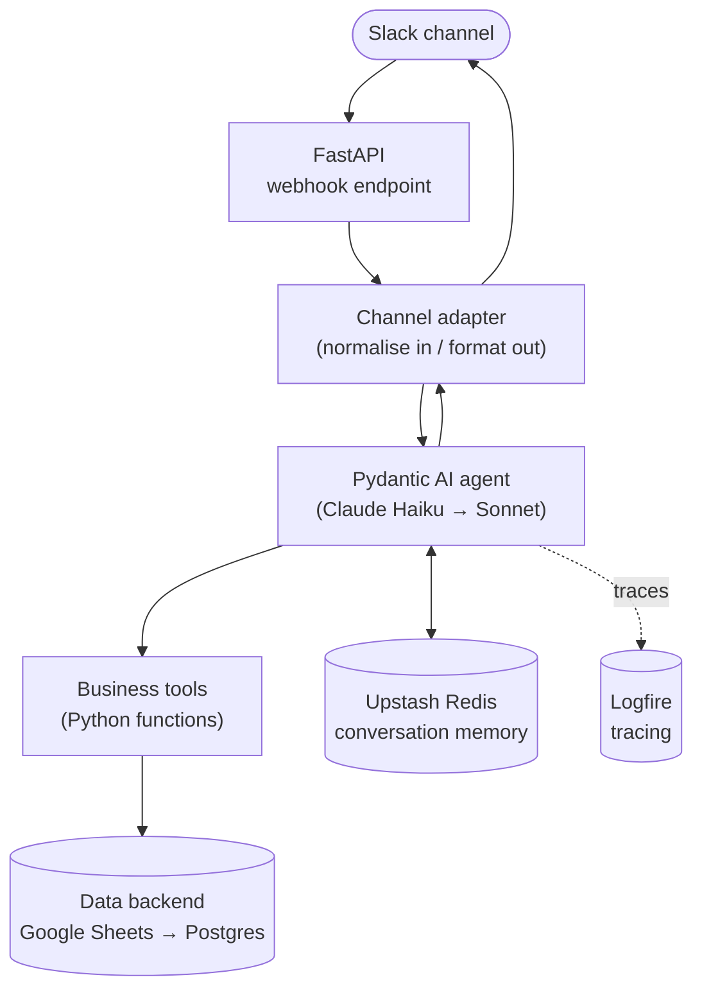
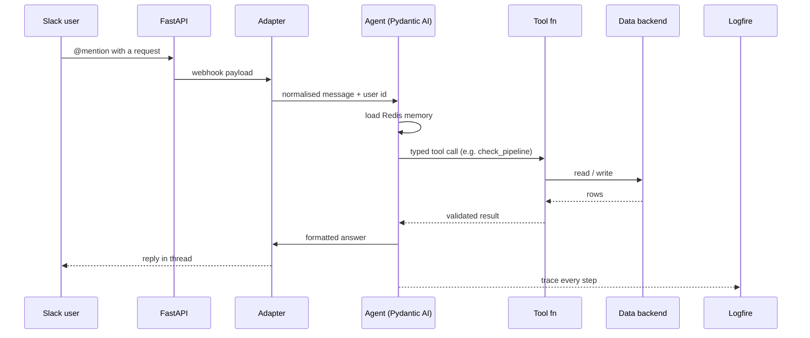

# Architecture — AI Business Command Centre

This document describes the design of the AI Business Command Centre: a multi-channel AI assistant that
exposes core business operations as agent tools, with tracing and evaluation built in from the start.
It is a re-platforming of an earlier no-code (Make.com) build into a production-grade engineering stack.

---

## Design principles

1. **One agent, five tools, one channel first.** Ship `check_pipeline` end-to-end on Slack before adding
   tools or channels. Breadth comes after one path works in production.
2. **Type-safe tool calling.** Pydantic AI validates every tool's inputs and outputs.
3. **Route cheap, escalate when needed.** A small fast model handles routing and CRUD; the agent
   escalates to a stronger model for multi-step reasoning.
4. **Observability and evaluation are first-class.** Every call is traced; an LLM-as-judge eval suite runs
   in CI rather than as an afterthought.
5. **Pragmatic infrastructure.** Prefer managed cloud services over local complexity (e.g. cloud Redis
   instead of local Docker) to remove whole classes of environment failure.

---

## System context

---

## Request lifecycle

---

## The five tools

| Tool | What it does |
|---|---|
| `check_pipeline` | Reads the live pipeline; answers e.g. *"deals over $100k closing this month"* |
| `send_invoice` | Creates an invoice entry and sends it to a client |
| `schedule_meeting` | Checks availability and books a meeting |
| `post_update` | Posts a status message to a channel |
| `pull_report` | Returns the latest weekly KPI summary |

`check_pipeline` is the reference implementation: it is the first tool taken all the way to production,
and the others follow the same shape.

---

## Technology choices

| Layer | Choice | Rationale |
|---|---|---|
| Language / packaging | Python 3.12, `uv` | Fast, single-tool dependency management |
| Web framework | FastAPI | Async, type-safe, Python AI-service default |
| Agent framework | Pydantic AI | Type-safe tools, model-agnostic, native Logfire |
| Primary / fallback model | Claude Haiku → Sonnet | Cheap routing; auto-escalation for reasoning |
| Memory | Upstash Redis | Per-user TTL context; no local Docker |
| Long-term store | Supabase Postgres | Preferences, audit log, embeddings |
| Data backend | Google Sheets → Postgres | Parity with the prior build; migrate one channel at a time |
| Channel SDK | Slack Bolt for Python | Official SDK |
| Hosting | Railway | Git-push deploys, managed add-ons |
| Observability | Logfire | Native Pydantic AI instrumentation |
| Evaluation | Pydantic Evals | LLM-as-judge, wired into CI |

### Why not LangChain / CrewAI
For a single agent with five tools, Pydantic AI is roughly an order of magnitude less configuration than
a graph framework, with fewer concepts to carry. A heavier framework earns its place only once genuine
multi-agent orchestration is required.

---

## Observability &amp; evaluation

Tracing is not optional. Every inbound message, model call, tool call and outbound reply is captured in
Logfire, so any answer can be traced back to the data and reasoning that produced it.

Evaluation runs as part of CI using Pydantic Evals with an LLM-as-judge: a fixed set of representative
requests is scored on whether the agent chose the right tool and produced a correct, well-formed answer.
A regression in tool selection or formatting fails the build, the same way a unit test would.

---

## A pragmatic decision, documented

During the build, Docker Desktop failed to install on Windows 11 (a permissions issue on a leftover
`DockerDesktop` data folder). Rather than spend a session fighting it, the design moved to Upstash Redis —
a managed cloud Redis — for both local development and production. The application code uses an async
Redis client that treats `redis://` and `rediss://` URLs identically, so the swap was a configuration
change, not a code change. The lesson recorded here: remove environment-specific failure modes rather
than debug them when a managed equivalent is available.

> Built with Claude Code. Australian English throughout.
